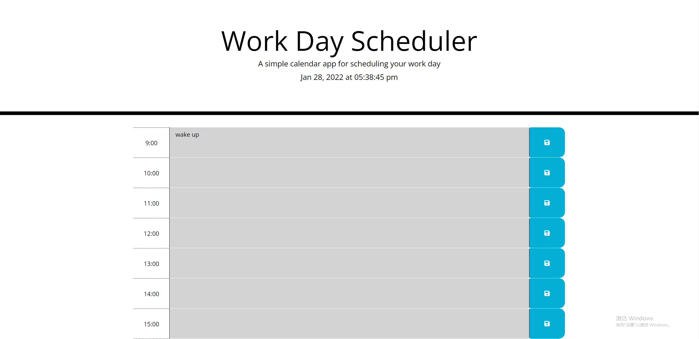

# Work-Day-Scheduler

## Description

The project creates a simple calendar application that allows a user to save events for each hour of the day by modifying starter code. User will be presented with timeblocks for standard business hours. Timeblock is color coded to indicate whether it is in the past, present, or future. This app will run in the browser and feature dynamically updated HTML and CSS powered by jQuerym, Bootstraps and font-awesome.

## Link

Click [here](https://jotaroc.github.io/Work-Day-Scheduler/) to the deployed website

## Screenshot

The following image is the sceenshot of web application's appearance:

---
Author:Xingzhi Chang
